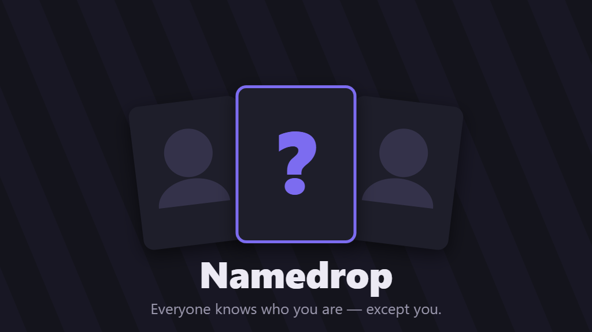

# Namedrop

**Play it: https://namedrop-mauve.vercel.app**

A real-time multiplayer party game for playing with friends over a voice call — a digital take on Hedbanz / the card-on-the-forehead game, where the answer pool is *anyone on Wikipedia*.

Everyone can see who you are — except you. Each round, players secretly assign each other a famous person (real or fictional) by searching Wikipedia live. Then you ask yes/no questions out loud to figure out who you are. First to call it and flip their card wins the round.

## How it works

- **No accounts, no installs** — the host creates a room, shares a 4-letter code or link, friends join from any browser (phones included)
- **Live Wikipedia search** — pickers search anyone who's ever existed (or been imagined), with thumbnails and descriptions to disambiguate; no pre-built lists, so no spoilers and infinite variety
- **Assignment ring** — players are shuffled into a cycle so everyone assigns exactly one other player, with no self-assignment
- **The one rule that makes it work** — the app never renders your own character to you until you flip your card
- **Turn-based or free-for-all**, live presence, automatic round-over detection, rematch with a reshuffled ring
- **Self-cleaning** — rooms older than 24 hours are swept automatically

## Tech

- **React + Vite** single-page app
- **Firebase Realtime Database** for room state and live sync (no server to run)
- **MediaWiki API** for search + images
- Hosted on **Vercel**

Full design document in [SPEC.md](SPEC.md).

## Run it locally

1. `npm install`
2. Create a free Firebase project with a Realtime Database
3. Copy `.env.example` to `.env.local` and fill in your Firebase web-app config
4. `npm run dev`, then open two browser windows to play both sides

Database rules live in [database.rules.json](database.rules.json) (published via the Firebase console Rules tab).

To deploy: `npm run build`, then serve `dist/` anywhere static (currently Vercel, project `namedrop`).

## Roadmap

- [ ] Discord Activity version — play embedded in a voice channel, with automatic lobbies from Discord identity
- [ ] Themed pool mode — everyone secretly seeds characters into a shared pot
- [ ] Group-confirm reveal option
